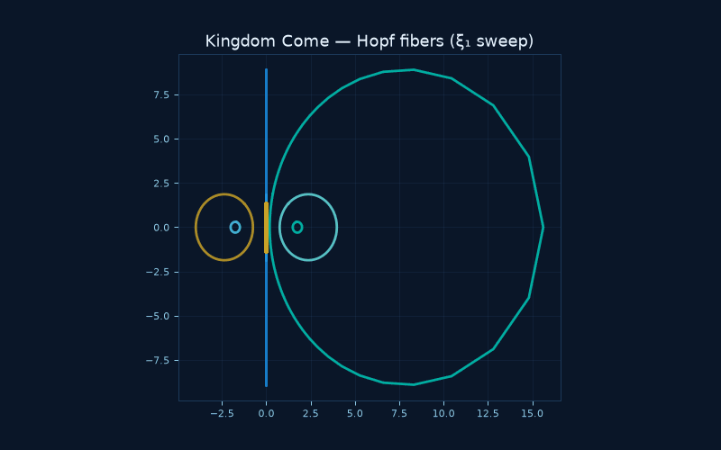
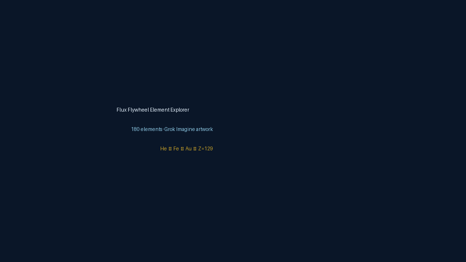
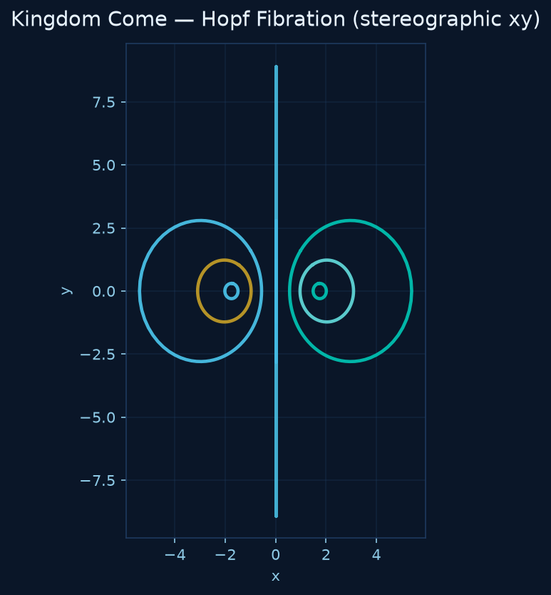
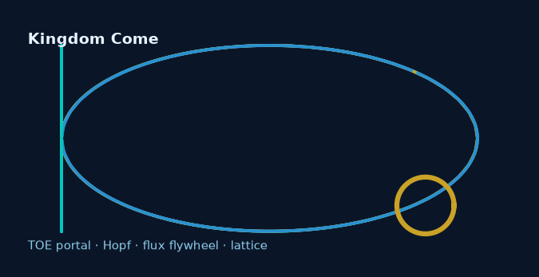
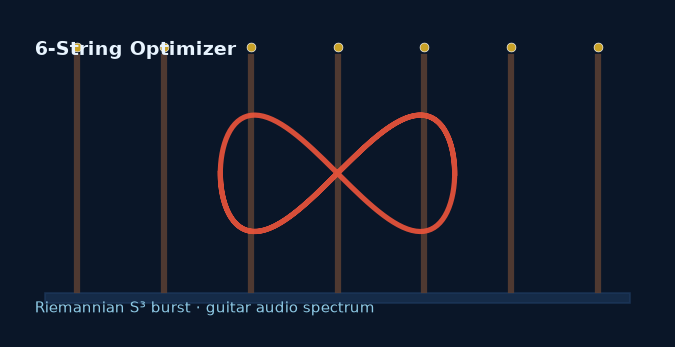
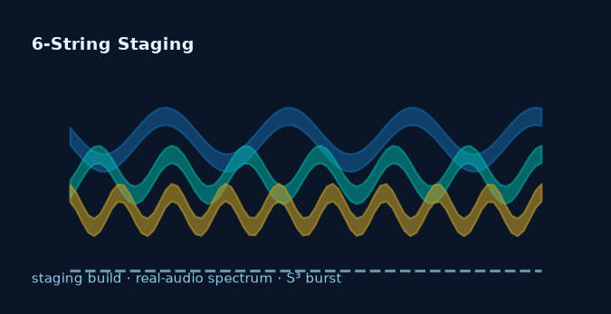
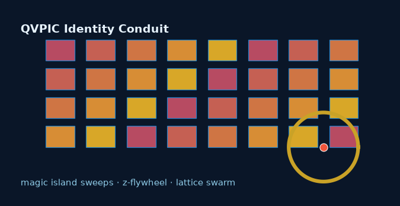
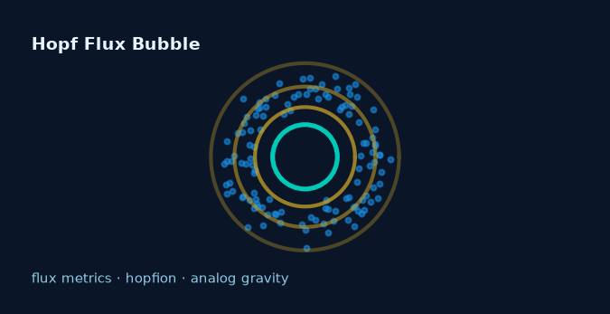
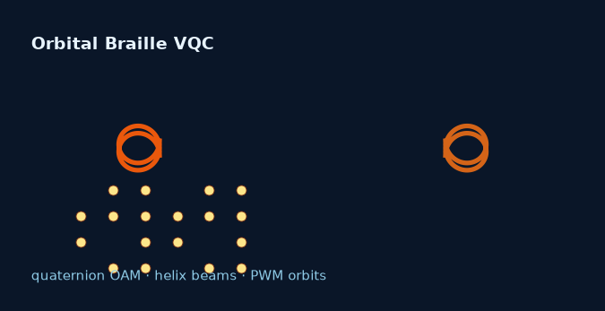
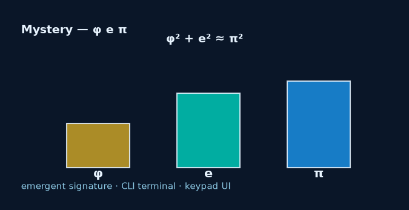

# Kingdom Come — Live Portal

<p align="center">
  
</p>

<p align="center"><em>Demo GIF: highlight fiber ξ₁ phase sweep — each loop is one fiber of the Hopf fibration.</em></p>

<p align="center">
  
</p>

<p align="center"><em>Flux Flywheel demo: He → Fe → Au → Z=129 — Imagine art, shell clouds, and stability metrics.</em></p>

<p align="center">
  
</p>

**Kingdom Come** is Aaron Michael Kinder's ([kinaar111](https://huggingface.co/kinaar111)) unified
**knowledge repository and interactive portal** for a Hopf-fibration-based Theory of Everything (TOE).

This is a **Gradio** Space (not Docker). Open the **App** tab above — no install required.

> **What it is:** scientific visualization + theory record platform linking topology, quaternions,
> gauged flux lattices, and emergent physics. **Not a game.**

---

## What you can do

| Tab | Action | Output |
|-----|--------|--------|
| **Hopf Visualizer** | Click **Classic Hopf** preset → **Update visualization** | 4-panel 2D view: linked fibers (xy/xz), S² base chart, phase map |
| **Lattice Simulator** | **Run lattice comparison** | Stable vs chaotic gauge pointer, twist, identity preservation |
| **The Model** | Read overview + derivation accordion | Core TOE postulates and Hopf→quaternion math |
| **Flux Flywheel** | Slide **Z** (try He=2, Ne=10) | Element card, electron cloud, chemistry vs TOE flux |
| **Showcase** | Browse links | Seven [kinaar111 HF Spaces](https://huggingface.co/kinaar111/spaces) |
| **Help** | Full walkthrough | Controls, limitations, tech stack |

---

## Quick start (60 seconds)

1. Go to **Hopf Visualizer**.
2. Keep **2D projections (recommended)** — HF iframes often block WebGL.
3. Press **Classic Hopf** → **Update visualization**.
4. Explore the four panels: stereographic fiber views and S² base markers.
5. Open **The Model** for the physics narrative.

---

## Tech stack

| Layer | Tools |
|-------|-------|
| UI | Gradio 6.19 |
| Math | NumPy, SciPy, SymPy |
| Viz | Plotly (2D HF-safe mode + optional 3D WebGL locally) |
| Hardware | **CPU-basic** — no GPU required |
| Source | [github.com/kinaar8340/kingdom_come](https://github.com/kinaar8340/kingdom_come) |

---

## Core model (one paragraph)

Physics emerges from **topologically protected flux flywheels** on a **gauged Hopf lattice**
in a porous vacuum. The Hopf fibration \(S^3 \to S^2\) is the geometric backbone; quaternions
supply the algebra; stable rotating flux configurations anchor emergent matter (periodic-table proxy
via Magic Island stability sweeps).

---

## Related Spaces (Showcase)

<p align="center">
  <em>Matches <a href="https://huggingface.co/kinaar111/spaces">kinaar111/spaces</a> — same thumbnails as the in-app Showcase tab.</em>
</p>

<table>
<tr>
<td width="50%" align="center" valign="top">
  <a href="https://huggingface.co/spaces/kinaar111/kingdom">
    
  </a><br/>
  <strong>Kingdom Come 👑</strong> · <a href="https://huggingface.co/spaces/kinaar111/kingdom">HF Space</a> · you are here<br/>
  <sub>Hopf fibration TOE portal &amp; visualizers</sub>
</td>
<td width="50%" align="center" valign="top">
  <a href="https://huggingface.co/spaces/kinaar111/6-string-optimizer">
    
  </a><br/>
  <strong>6-String Optimizer 🎸</strong> · <a href="https://huggingface.co/spaces/kinaar111/6-string-optimizer">HF Space</a><br/>
  <sub>Riemannian S³ burst optimizer + guitar audio showcase</sub>
</td>
</tr>
<tr>
<td width="50%" align="center" valign="top">
  <a href="https://huggingface.co/spaces/kinaar111/staging">
    
  </a><br/>
  <strong>6-String Optimizer Staging 🎸</strong> · <a href="https://huggingface.co/spaces/kinaar111/staging">HF Space</a><br/>
  <sub>Six-string S³ burst optimizer + real-audio spectrum</sub>
</td>
<td width="50%" align="center" valign="top">
  <a href="https://huggingface.co/spaces/kinaar111/qvpic">
    
  </a><br/>
  <strong>QVPIC Identity Conduit 🌀</strong> · <a href="https://huggingface.co/spaces/kinaar111/qvpic">HF Space</a><br/>
  <sub>Quaternion vortex persistent identity — browser demo</sub>
</td>
</tr>
<tr>
<td width="50%" align="center" valign="top">
  <a href="https://huggingface.co/spaces/kinaar111/hopf-flux-bubble">
    
  </a><br/>
  <strong>Hopf Flux Bubble 🫧</strong> · <a href="https://huggingface.co/spaces/kinaar111/hopf-flux-bubble">HF Space</a><br/>
  <sub>Analog flux bubble metrics — browser demo</sub>
</td>
<td width="50%" align="center" valign="top">
  <a href="https://huggingface.co/spaces/kinaar111/orbital-braille-vqc">
    
  </a><br/>
  <strong>Orbital Braille VQC 🔤</strong> · <a href="https://huggingface.co/spaces/kinaar111/orbital-braille-vqc">HF Space</a><br/>
  <sub>Orbital Braille VQC Typehead — browser demo</sub>
</td>
</tr>
<tr>
<td width="50%" align="center" valign="top" colspan="2">
  <a href="https://huggingface.co/spaces/kinaar111/mystery">
    
  </a><br/>
  <strong>Mystery 🔮</strong> · <a href="https://huggingface.co/spaces/kinaar111/mystery">HF Space</a><br/>
  <sub>φ²+e²≈π² emergent signature — CLI terminal + keypad UI</sub>
</td>
</tr>
</table>

---

## Local development

```bash
git clone https://github.com/kinaar8340/kingdom_come.git
cd kingdom_come
python -m venv .venv && source .venv/bin/activate
pip install -e ".[dev]"
python app/app.py
```

---

## Changelog

| Version | Notes |
|---------|-------|
| **v0.2.0** | Flux Flywheel element explorer, electron clouds, neon badge plugin |
| **v0.1.4** | Panel guide accordion, clearer HF 2D messaging, GIF alt text |
| **v0.1.3** | WebGL hotfix — force 2D-only on Hugging Face |
| **v0.1.2** | Visual polish, onboarding accordion, showcase cards, reset + auto-update presets |
| **v0.1.1** | Demo GIF; Lattice Simulator tab (toe two-gyro integration) |
| **v0.1.0** | Initial portal: Hopf visualizer, theory, flux flywheel, showcase |
| v0.1.0+ | HF-safe 2D projections; Help tab; presets; README polish |

---

## License

MIT — see [LICENSE](LICENSE). Author: Aaron Michael Kinder · [kinaar111](https://huggingface.co/kinaar111)